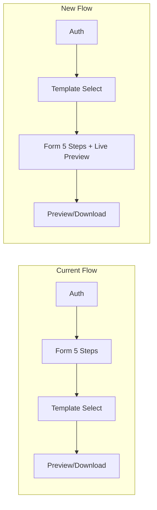

# Template Selection Before Form + Live Side-by-Side Preview

## Flow Change




The template selection page moves **before** the form. The form gains a split-screen layout with a live-updating resume preview on the right and a template switcher dropdown.

## Architecture: Live Preview Strategy

The existing templates are server-side Handlebars `.hbs` files in `[server/templates/](server/templates/)`. Rather than duplicating them as React components (creating two sources of truth), the live preview will:

1. Collect all form data from the Zustand store
2. Debounce changes (~1.5s)
3. POST the data to a new `POST /api/resume/preview-live` endpoint
4. Render the returned HTML in an iframe via `srcdoc`

This reuses the existing Handlebars templates with zero duplication.

---

## Backend Changes

### 1. New preview endpoint in `[server/src/controllers/preview.controller.ts](server/src/controllers/preview.controller.ts)`

Add `postPreviewLive` -- accepts full resume data + template name in the request body, renders via `renderTemplate()`, returns HTML. Unlike `getPreview` which reads from DB, this renders from the request body directly so the user doesn't need to save first.

### 2. Register the route in `[server/src/routes/resume.route.ts](server/src/routes/resume.route.ts)`

```
POST /api/resume/preview-live  -->  postPreviewLive
```

Placed before the `/:id` routes to avoid param conflict.

---

## Frontend Changes

### 3. New page: `client/app/(protected)/templates/select/page.tsx`

A dedicated pre-form template selection page. Shows the 5 templates as clickable cards with the existing `TemplateMiniPreview` renderer (extracted from the current `[templates/page.tsx](client/app/(protected)`/templates/page.tsx)). On click:

- Sets `selectedTemplate` in the Zustand store (local only, no API call yet)
- Navigates to `/form/personal`

### 4. Update middleware redirect in `[client/middleware.ts](client/middleware.ts)`

Change the authenticated-user redirect from `/form/personal` to `/templates/select`, so the new template selection is the first stop after login.

### 5. Rewrite form layout: `[client/app/(protected)/form/layout.tsx](client/app/(protected)`/form/layout.tsx)

Convert from single-column to a split-screen layout:

```
Desktop (>=1024px):
+------------------+------------------+
| Stepper + Form   | Template Switch  |
| (scrollable)     | Live Preview     |
|                  | (scrollable)     |
+------------------+------------------+

Mobile (<1024px):
+----------------------------------+
| [Form] [Preview] tab toggle      |
| Active tab content               |
+----------------------------------+
```

- Left side: existing stepper nav + form content (children)
- Right side: `TemplateSwitch` dropdown + `LivePreview` component
- Collapsible on mobile via a tab toggle
- The preview panel reads all step data from the store

### 6. New component: `client/components/preview/LivePreview.tsx`

- Subscribes to the full Zustand store (step1 through step5 + selectedTemplate)
- Debounces changes with a 1500ms timer
- Calls `POST /api/resume/preview-live` with assembled resume data
- Renders the HTML response into an `<iframe srcdoc={html} />`
- Shows a loading skeleton on first load and a subtle spinner on subsequent updates

### 7. New component: `client/components/form/TemplateSwitch.tsx`

A compact dropdown (using a native `<select>` or the existing design system style) that:

- Reads `selectedTemplate` from the store
- On change, updates the store locally via a new sync `setTemplateLocal` action (no API call -- the template is persisted when form data is eventually saved)
- Triggers a preview refresh

### 8. Update Zustand store: `[client/store/resumeStore.ts](client/store/resumeStore.ts)`

Add a `setTemplateLocal` action that sets `selectedTemplate` without making an API call (for use during form filling when we don't want to persist yet). The existing async `setTemplate` remains for the final save.

### 9. Update summary page: `[client/app/(protected)/form/summary/page.tsx](client/app/(protected)`/form/summary/page.tsx)

Change the "Choose template" finish button to navigate directly to `/preview` instead of `/templates`, since template is already chosen.

### 10. Update existing templates page: `[client/app/(protected)/templates/page.tsx](client/app/(protected)`/templates/page.tsx)

Redirect to `/templates/select` (or remove, keeping it as a redirect) so old bookmarks still work. The existing page's navigation links that point to `/form/summary` as "Back" will be updated.

---

## Key Design Decisions

- **No schema changes needed** -- Improvements 1 & 2 are purely flow/UI changes
- **No new dependencies** -- uses native iframe + existing Handlebars rendering
- **Preview is debounced, not real-time** -- 1.5s delay avoids hammering the server
- **Template selection is local-first** -- stored in Zustand immediately, persisted to DB when the form is eventually saved via `setTemplate`
- **Mobile-friendly** -- preview collapses to a tab on small screens instead of always showing split-screen

